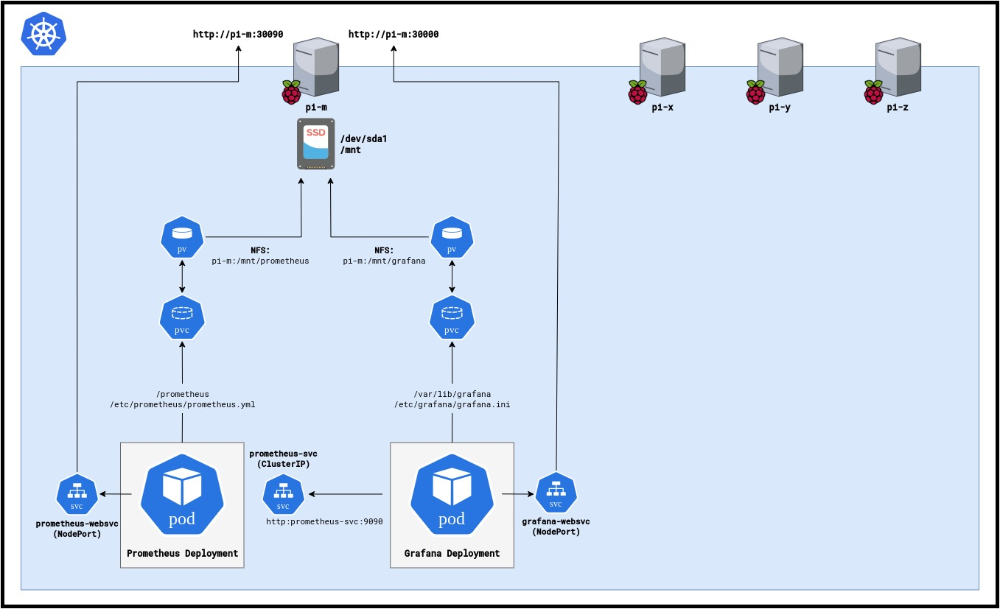

# 🖥 Homelab 
My homelab documentation; network/system diagrams, config files, scripts, source code of my apps and anything else.

--------------------

## To do

- [] **Server Banners** Login ASCII Banners for each RPi, as an Ansible Module.
- [X] **DNS Server** (Bind9 on pi-m)(to-do: Use gitzone to version control zone files)
- [X] **DHCP Server**
- [X] **Raspberry Pi Kubernetes Cluster, where most of these services are hosted**
- [X] **Prometheus** (K8s deployment)
- [X] **Grafana** (K8s deployment)
- [X] **Grafana dashboard: Homelab monitoring, weather radar, traffic map, calorie count, strava metrics, tasks?**
- [X] **Youtube DL** (Microservice/deployment)
- [X] **Service matrix(table)**
- [ ] **Discord/Telegram public IP bot**
- [ ] **Samba DC**
- [ ] **NTP Server**
- [ ] **Prometheus snmp_exporter** (K8s deployment)
- [ ] **qBitTorrent**
- [ ] **MDADM USB Array on a Raspberry Pi as an NFS/SMB share** (Mostly for read operations, as the USBs won't handle many write cycles)
- [ ] **rr suite** (Prowlarr, Lidarr, Sonarr, Radarr)
- [ ] **Torrent-exclusive VPN**
- [ ] **Wireguard VPN for outside access**
- [ ] **DynDNS**
- [ ] **PVE** (Proxmox Virtual Environment on my Dell R620)
- [ ] **Changelog for tracking**
-------------------

## L1 Diagram

--------------------

## L3 Diagram

--------------------

## Monitoring Diagram

Prometheus/Grafana setup in the picluster.

--------------------

## Service Matrix

<table>
  <thead>
    <tr>
      <th>Service</th>
      <th>Deployed As</th>
      <th>Endpoint</th>
      <th>K8s NS</th>
      <th>K8s DEP</th>
      <th>K8s SVC</th>
    </tr>
  </thead>
  <tbody>
    <tr>
      <td>DNS Server</td>
      <td>Bind Server on pi-m</td>
      <td>172.17.0.1 TCP+UDP/53</td>
      <td>N/A</td>
      <td>N/A</td>
      <td>N/A</td>
    </tr>
    <tr>
      <td>DHCP Server for 172 network</td>
      <td>DHCP service on ER-X</td>
      <td>172.17.0.254</td>
      <td>N/A</td>
      <td>N/A</td>
      <td>N/A</td>
    </tr>
    <tr>
      <td>Prometheus</td>
      <td>K8s deployment</td>
      <td>2x K8s SVCs: ClusterIP & NodePort SVC (prometheus-websvc [172.17.0.1/2/3/4:30090/TCP] & ER-X port-mapping [192.168.1.254:60390/TCP])</td>
      <td>monitoring</td>
      <td>deployment.apps/prometheus</td>
      <td>prometheus-svc (ClusterIP 9090/TCP) and prometheus-websvc (NodePort 9090:30090/TCP)</td>
    </tr>
    <tr>
      <td>Grafana</td>
      <td>K8s deployment</td>
      <td>K8s NodePort SVC (grafana-websvc [172.17.0.1/2/3/4:30000/TCP] & ER-X port-mapping [192.168.1.254:60300/TCP])</td>
      <td>monitoring</td>
      <td>deployment.apps/grafana</td>
      <td>grafana-websvc (NodePort 3000:30000/TCP)</td>
    </tr>
    <tr>
      <td>yt-dlp</td>
      <td>K8s deployment</td>
      <td>K8s NodePort SVC (grafana-websvc [172.17.0.1/2/3/4:30001/TCP] & ER-X port-mapping [192.168.1.254:60001/TCP])</td>
      <td>apps</td>
      <td>deployment.apps/yt-dlp</td>
      <td>yt-dlp-websvc (NodePort 5000:30001/TCP)</td>
    </tr>
   </tbody>
 </table>

--------------------

## ER-X Port-maps Table

--------------------

## Addressing Plan

### Networks

<table>
  <thead>
    <tr>
      <th>NET</th>
      <th>VLAN</th>
      <th>CIDR</th>
      <th>GW</th>
      <th>DNS</th>
      <th>DHCP</th>
      <th>DHCP Range</th>
      <th>Static IPs Range</th>
    </tr>
  </thead>
  <tbody>
    <tr>
      <td>192</td>
      <td>N/A</td>
      <td>192.168.1.0/24</td>
      <td>192.168.1.1</td>
      <td>???</td>
      <td>192.168.1.1</td>
      <td>.151 to .200</td>
      <td>.1 to .150</td>
    </tr>
    <tr>
      <td>172</td>
      <td>N/A</td>
      <td>172.17.0.0/16</td>
      <td>172.17.0.254</td>
      <td>???</td>
      <td>172.17.0.254</td>
      <td>.69.0 to .69.255</td>
      <td>.0.1 to .10.255</td>
    </tr>
    <tr>
      <td>K8s pods</td>
      <td>N/A</td>
      <td>172.18.0.0/16</td>
      <td>N/A</td>
      <td>N/A</td>
      <td>N/A</td>
      <td>N/A</td>
      <td>N/A</td>
    </tr>
 </tbody>
</table>

### Hosts

<table>
  <thead>
    <tr>
      <th>HOSTNAME</th>
      <th>DEVICE</th>
      <th>NIC</th>
      <th>MAC</th>
      <th>BOND/LACP</th>
      <th>IP</th>
      <th>CONNECTED TO</th>
    </tr>
  </thead>
  <tbody>
    <!-- pi-x (k8s worker) -->
    <tr>
      <td>pi-x</td>
      <td rowspan="3">Raspberry Pi 3 B+</td>
      <td>eth0</td>
      <td>b8:27:eb:d5:c0:15</td>
      <td>N/A</td>
      <td>172.17.0.2</td>
      <td>gs1920 P18</td>
    </tr>
    <!-- pi-y (k8s worker) -->
    <tr>
      <td>pi-y</td>
      <td>eth0</td>
      <td>b8:27:eb:57:ef:a8</td>
      <td>N/A</td>
      <td>172.17.0.3</td>
      <td>gs1920 P20</td>
    </tr>
    <!-- pi-z (k8s worker) -->
    <tr>
      <td>pi-z</td>
      <td>eth0</td>
      <td>b8:27:eb:be:ae:a3</td>
      <td>N/A</td>
      <td>172.17.0.4</td>
      <td>gs1920 P22</td>
    </tr>
    <!-- pi-m (k8s master) -->
    <tr>
      <td>pi-m</td>
      <td>Raspberry Pi 5 8GB</td>
      <td>eth0</td>
      <td>2c:cf:67:26:4a:55</td>
      <td>N/A</td>
      <td>172.17.0.1</td>
      <td>gs1920 P24</td>
    </tr>
   <!-- Z10 -->
    <tr>
      <td rowspan="3">z10</td>
      <td rowspan="3">My Workstation</td>
      <td>NICX</td>
      <td>00-00-00-00-00-00</td>
      <td>N/A</td>
      <td>172.17.0.10</td>
      <td>gs1920 PX</td>
    </tr>
    <tr>
      <td>NIC2</td>
      <td>00-00-00-00-00-04</td>
      <td>N/A</td>
      <td>X</td>
      <td>gs1920 PX</td>
    </tr>
    <tr>
      <td>NIC3</td>
      <td>00-00-00-00-00-04</td>
      <td>N/A</td>
      <td>X</td>
      <td>gs1920 PX</td>
    </tr>
    <!-- ERX -->
    <tr>
      <td rowspan="5">erx</td>
      <td rowspan="5">UbiQuiti EdgeRouter X</td>
      <td>ETH0</td>
      <td>00-00-00-00-00-03</td>
      <td>N/A</td>
      <td>X</td>
      <td>3505vw ETH1</td>
    </tr>
    <tr>
      <td>ETH1</td>
      <td>00-00-00-00-00-04</td>
      <td rowspan="2">bond0</td>
	  <td>N/A</td>
      <td>gs1920 P6</td>
    </tr>
    <tr>
      <td>ETH2</td>
      <td>00-00-00-00-00-05</td>
      <td>N/A</td>
      <td>gs1920 P8</td>
    </tr>
    <tr>
      <td>ETH3</td>
      <td>00-00-00-00-00-05</td>
      <td>N/A</td>
      <td>X</td>
      <td>gs1920 PX</td>
    </tr>
    <tr>
      <td>ETH4</td>
      <td>00-00-00-00-00-05</td>
      <td>N/A</td>
      <td>X</td>
      <td>gs1920 PX</td>
    </tr>
    <!-- 3505VW -->
    <tr>
      <td rowspan="4">3505vw</td>
      <td rowspan="4">HGU Askey 3505VW</td>
      <td>ETH1</td>
      <td>00-00-00-00-00-03</td>
      <td>N/A</td>
      <td>X</td>
      <td>X</td>
    </tr>
    <tr>
      <td>ETH2</td>
      <td>00-00-00-00-00-04</td>
      <td>N/A</td>
      <td>X</td>
      <td>X</td>
    </tr>
    <tr>
      <td>ETH3</td>
      <td>00-00-00-00-00-05</td>
      <td>N/A</td>
      <td>X</td>
      <td>X</td>
    </tr>
    <tr>
      <td>ETH4</td>
      <td>00-00-00-00-00-05</td>
      <td>N/A</td>
      <td>X</td>
      <td>X</td>
    </tr>
    <!-- R620 -->
    <tr>
      <td rowspan="5">r620</td>
      <td rowspan="5">Dell PowerEdge R620</td>
      <td>NIC1</td>
      <td>00-00-00-00-00-00</td>
      <td>N/A</td>
      <td>172.17.0.100</td>
      <td>XX</td>
    </tr>
    <tr>
      <td>NIC2</td>
      <td>00-00-00-00-00-04</td>
      <td>N/A</td>
      <td>X</td>
      <td>XX</td>
    </tr>
    <tr>
      <td>NIC3</td>
      <td>00-00-00-00-00-05</td>
      <td>N/A</td>
      <td>X</td>
      <td>XX</td>
    </tr>
    <tr>
      <td>NIC4</td>
      <td>00-00-00-00-00-05</td>
      <td>N/A</td>
      <td>X</td>
      <td>XX</td>
    </tr>
    <tr>
      <td>NIC5</td>
      <td>00-00-00-00-00-05</td>
      <td>N/A</td>
      <td>X</td>
      <td>XX</td>
    </tr>
    <!-- GS1920 -->
    <tr>
      <td>gs1920</td>
      <td>ZyXEL GS1920-24</td>
      <td>NICX</td>
      <td>00-00-00-00-00-00</td>
      <td>N/A</td>
      <td>172.17.0.253</td>
      <td>XX</td>
    </tr>
  </tbody>
</table>

--------------------

## Other

#### Why use a git repository

I have tried different ways of documenting my homelab environment (simple .txt files, docs, spreadsheets). The simplicity of a git repo and having everything condensed on a README.md is really convenient, easy to access, modify, track and share.

#### Security concerns (?)

Yes, sharing my internal network in such detail goes against all and any security practices.

--------------------
