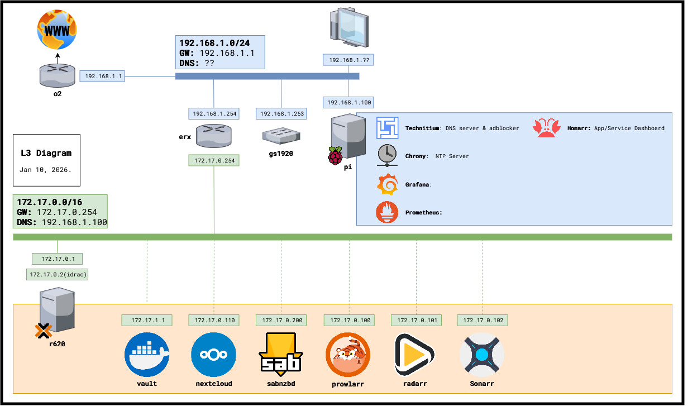
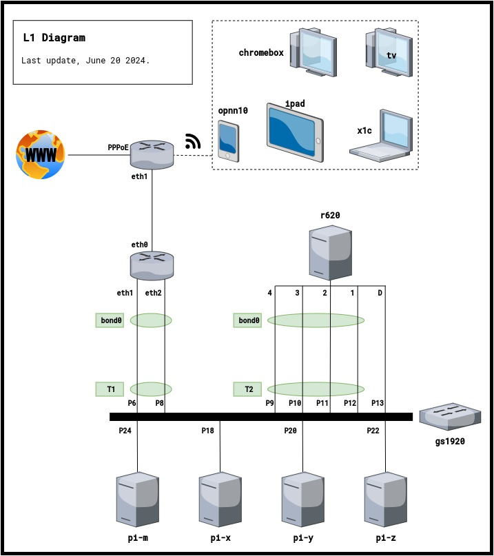
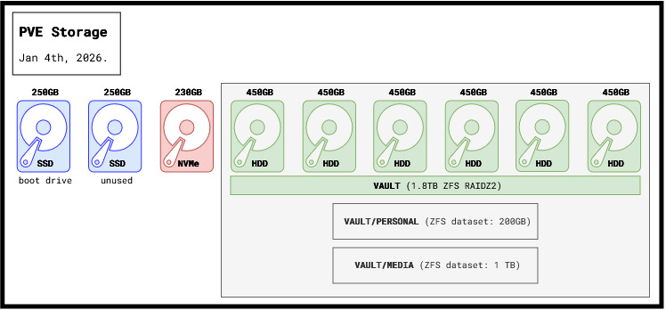

# 🖥 Homelab 

My homelab documentation; network/system diagrams, config files, scripts, source code of my apps and anything else.


## ✅ To do

- [X] **DNS Server** (Technitium on pi)
- [X] **DNS-over-QUIC** on Technitium 
- [ ] RAID1 proxmox boot SSDs?
- [ ] **Prometheus**
- [ ] **Grafana**
- [ ] **Youtube DL**


## 🔌 L3 Diagram




## 🔌 L1 Diagram




## 💾 PVE Storage

Checkout [VAULT.md](VAULT.md) for a full explanation of how I am handling storage with an LXC acting as a NAS.




## 🌐 Addressing Plan

<details>

### Networks

```
+===========================+======+==============+===============+================+==================+=======================================+==========+
|          NETWORK          | VLAN |      GW      |      DNS      |      DHCP      |    DHCP Range    |                 Static IPs Range                 |
+===========================+======+==============+===============+================+==================+======================================+===========+
| 192.168.1.0/24 (Home)     | 192  | 192.168.1.1  | 192.168.1.100 | 192.168.1.100  | .151 to .200     | .1 to .150                                       |
+---------------------------+------+--------------+---------------+----------------+------------------+--------------------------------------------------+
| 172.17.0.0/16 (HomeLab)   | 172  | 172.17.0.254 | 192.168.1.100 | 172.17.0.254   | .99.0 to .99.255 | .0.0 to .0.255 (Physical hosts and VMs)          |
|                           |      |              |               |                |                  | .1.0 to .1.255 (Containers)                      |
+---------------------------+------+--------------+---------------+----------------+------------------+--------------------------------------------------+
```


#### Physical Hosts

```
+==============+=========================+=========+=============+================+================+
|   HOSTNAME   |          DEVICE         |   NIC   |  BOND/LACP  |       IP       |  CONNECTED TO  |
+==============+=========================+=========+=============+================+================+
| pi           | Raspberry Pi 5 8GB      | eth0    | N/A         | 192.168.1.100  | gs1920 P18     |
+--------------+-------------------------+---------+-------------+----------------+----------------+
| erx          | Ubiquiti EdgeRouter X   | eth0    | N/A         | 192.168.1.254  | gs1920 P10     |
|              |                         | eth1    | N/A         | 172.17.0.254   | gs1920 P12     |
+--------------+-------------------------+---------+-------------+----------------+----------------+
| gs1920       | ZyXEL GS1920-24         | N/A     | N/A         | 192.168.1.253  | N/A            |
+--------------+-------------------------+---------+-------------+----------------+----------------+
| z10          | My Workstation          | NIC0    | N/A         | 192.168.1.XX   | gs1920 P26     |
+--------------+-------------------------+---------+-------------+----------------+----------------+
| o2           | HGU Askey 3505VW        | eth4    | N/A         | 192.168.1.1    | gs1920 P2      |
+--------------+-------------------------+---------+-------------+----------------+----------------+
| r620         | DELL PowerEdge R620     | idrac   | N/A         | 172.17.0.101   | gs1920 P19     |
|              |                         | eth1    | YES         | 172.17.0.1     | gs1920 P21     |
|              |                         | eth2    | YES         |                | gs1920 P23     |
+--------------+-------------------------+---------+-------------+----------------+----------------+
```


#### Virtual Hosts

```
+==============+=========================+=========+================+
|   HOSTNAME   |          DEVICE         |   NIC   |       IP       |
+==============+=========================+=========+================+
| vault        | PVE Debian 13 LXC       | eth0    | 172.17.1.1     |
+--------------+-------------------------+---------+----------------+
| prowlarr     | PVE Debian 13 VM        | eth0    | 172.17.0.100   |
+--------------+-------------------------+---------+----------------+
```


### Service Matrix

```
+==================================+===============+==================================================+
|               Service            |     Host      |                     Endpoint                     |
+==================================+===============+==================================================+
| DNS Server (Technitium)          | pi            | 192.168.1.100 TCP+UDP/53 & TCP 5380 (Web portal) |
+----------------------------------+---------------+--------------------------------------------------+
| NTP Server (Chrony)              | pi            | 192.168.1.100 UDP/123                            |
+----------------------------------+---------------+--------------------------------------------------+
| DHCP Server for 192.168.1.0/24   | o2 router     | 192.168.1.1 UDP/67                               |
+----------------------------------+---------------+--------------------------------------------------+
| VAULT (NFS/SAMBA on a PVE LXC)   | LXC "vault"   | 172.17.1.1 TCP/2049 (NFS)                        |
|                                  |               | 172.17.1.1 TCP/445  (SAMBA)                      |
+----------------------------------+---------------+--------------------------------------------------+
| prowlarr                         | VM "prowlarr" | 172.17.0.100 TCP/9696 (Web portal)               |
+----------------------------------+---------------+--------------------------------------------------+
```


### ER-X Port-maps Table

--------------------
</details>
