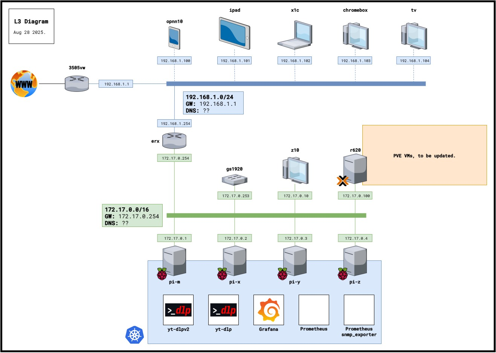

# 🖥 Homelab 
My homelab documentation. Network/System diagrams, configuration files, apps, scripts and else.

--------------------

## Services

- Samba DC
- DNS Server
- NTP Server
- DHCP Server
- MDADM USB Array on a Raspberry Pi as an NFS/SMB share
- Prometheus/Grafana
- qBitTorrent
- *rr suite (Prowlarr, Lidarr, Sonarr, Radarr)
- Torrent-exclusive VPN
- Wireguard VPN for outside access
- DynDNS
- PVE (Proxmox on my Dell R620)
- Raspberry Pi 3b+ Kubernetes Cluster, where most of these services are hosted.

- *To add service matrix(table)*

-------------------

## L1 Diagram

--------------------

## L3 Diagram

--------------------

## Addressing Plan

| NET | VLAN | CIDR           | GW           | DNS | DHCP         | DHCP Range       | Static IPs Range |
| :-- | :--- | :------------- | :----------- | :-- | :----------- | :--------------- | :--------------- |
| ??? | N/A  | 192.168.1.0/24 | 192.168.1.1  | ??? | 192.168.1.1  | .151 - .200      | .1 - .150        |

| NET | VLAN | CIDR           | GW           | DNS | DHCP         | DHCP Range       | Static IPs Range |
| :-- | :--- | :------------- | :----------- | :-- | :----------  | :--------------- | :--------------- |
| ??? | N/A  | 172.17.0.0/16  | 172.17.0.254 | ??? | 172.17.0.254 | .69.0 - .69.255  | .0.1 - .10.255   |

| HOSTS |
| :---: |
| NET | VLAN | CIDR           | GW           | DNS | DHCP         | DHCP Range       | Static IPs Range |
| :-- | :--- | :------------- | :----------- | :-- | :----------  | :--------------- | :--------------- |
| ??? | N/A  | 172.17.0.0/16  | 172.17.0.254 | ??? | 172.17.0.254 | .69.0 - .69.255  | .0.1 - .10.255   |
--------------------

## Other

#### Why use a git repository

I have tried different ways of documenting my homelab environment (simple .txt files, docs, spreadsheets). The simplicity of a git repo and having everything condensed on a README.md is really convenient, easy to access, modify, track and share.

#### Security concerns (?)

Yes, sharing my internal network in such detail goes against all and any security practices. That being said, I'm realistically a target to no one, and if I am, your welcome to try.

--------------------
